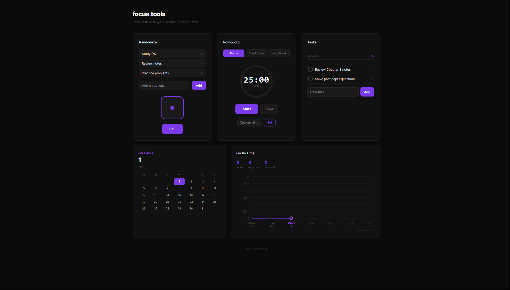

# focus.tools

> A minimal productivity dashboard built for students who struggle with **what to work on** and **staying consistent**.

**Live site → [focus-tools-lemon.vercel.app](https://focus-tools-lemon.vercel.app)**

---

## The problem

Every student knows the feeling. You sit down to study, open your laptop, and suddenly you have no idea where to begin. Do you review last week's notes? Start the assignment due Friday? Practice the problems from Tuesday's lecture? You have five subjects, a dozen pending tasks, and a brain that would rather do anything else than make that decision.

So you spend 20 minutes shuffling between tabs, maybe make a coffee, check your phone — and by the time you actually start, the momentum is already gone.

focus.tools was built to fix exactly that. It removes the friction between sitting down and actually working. No login screen, no onboarding, no settings to configure. You open it, roll the dice, and start a timer. That's the whole thing.

---

## What's inside

### 🎲 Randomizer
Add your subjects, topics, or tasks to the list. Hit Roll. The dice picks one for you at random. It sounds simple because it is — but removing the decision entirely is often all it takes to get started. No more staring at a list of 10 things wondering which one matters most. Chance decides. You execute.

### ⏱ Pomodoro Timer
The classic 25-minute focus technique, built clean. Three modes: Focus (25 min), Short Break (5 min), Long Break (15 min). Custom duration supported for when you need a 45-minute deep work block or a quick 10-minute review sprint. When a session completes, the time is automatically logged to your focus chart — no manual tracking needed.

### ✅ Task List
A no-frills checklist for the things you need to get done today. Add tasks, tick them off, watch the progress bar fill up. Completed tasks can be cleared in bulk. Simple enough that you'll actually use it instead of reaching for a separate app.

### 📅 Calendar
The current month, always visible, with today's date highlighted in purple. It's not interactive — it's just there as a quiet anchor. Knowing the date matters when you're deep in a study session and time starts to blur.

### 📈 Focus Time Chart
A weekly line graph showing how many minutes you've ground out each day, Monday through Sunday. The Y-axis goes up in 30-minute increments. The chart shows your daily average, today's total, and your weekly total. It resets clean every Monday so you're always looking at the current week. The point isn't to make you feel guilty on bad days — it's to show you the trend, so the good days feel worth it.

---

## Screenshots



---

## Tech stack

| | |
|---|---|
| Framework | [Next.js 15](https://nextjs.org) (App Router) |
| Language | TypeScript |
| Styling | Tailwind CSS + inline styles |
| Deployment | [Vercel](https://vercel.com) |
| Data | `localStorage` — no backend, no database, no account needed |

---

## Running locally

```bash
git clone https://github.com/fardeenrahman13/focus-tools.git
cd focus-tools
npm install
npm run dev
```

Open [http://localhost:3000](http://localhost:3000).

---

## Deploy your own copy

Want to host your own version? Takes about two minutes:

```bash
npm install -g vercel
vercel --prod
```

Vercel auto-detects Next.js. No config files, no environment variables, nothing to set up. Your own focus dashboard, live on a public URL you can share with classmates.

---

## Project structure

```
focus-tools/
├── app/
│   ├── page.tsx        ← every tool lives in this one file
│   ├── layout.tsx      ← root layout and page metadata
│   └── globals.css     ← color tokens and hover animations
├── public/             ← static assets (screenshot, etc.)
└── README.md
```

Everything is in `page.tsx`. There's no routing, no API calls, no external state management. If you want to fork this and change something, you'll find it in under a minute.

---

## Design philosophy

**Minimal by default.** Every feature has to earn its place. If it doesn't directly help you study, it's not in the app.

**No accounts, ever.** Your data lives in your browser's `localStorage`. It never leaves your device. There's no server receiving your task list or your study hours. Private by design, not by policy.

**One file, readable code.** The entire UI is a single `page.tsx` file written in TypeScript with React. No complex abstractions, no design systems to learn. A student who's taken one web dev course should be able to read it, understand it, and change it.

**Dark theme only.** Late-night study sessions are real. The black background with electric violet accents is easy on the eyes and keeps the focus on the content, not the chrome.

---

## Contributing

This started as a personal project to solve a real problem. If you're a student and you have ideas — a countdown to exam dates, a subject weightage tracker, a habit streak counter — open an issue or send a pull request. The codebase is intentionally simple so contributing doesn't require a deep understanding of the whole project.

---

## License

MIT — free to use, modify, and share with your study group.

---

*Stop deciding. Start working.*
